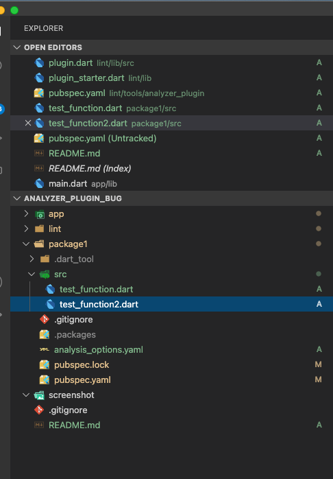

Update the local path in lint/tools/analyzer_plugin/pubspec.yaml

Open the root directory in vscode:


Open test_function2.dart and edit the file or do something that will run a file analysis.

You should see problems in the vscode console:

I shortened the paths by hand for better visibility:

```
hashCode: 895745629
contexts: [ analyzer_plugin_bug/app/analysis_options.yaml,  analyzer_plugin_bug/lint/analysis_options.yaml,  analyzer_plugin_bug/lint/lib/analysis_options.yaml,  analyzer_plugin_bug/package1/analysis_options.yaml]
analysisContext.contextRoot.root.path:  analyzer_plugin_bug/package1
analysisContext.contextRoot.optionsFile?.path  analyzer_plugin_bug/package1/analysis_options.yaml
path:  analyzer_plugin_bug/package1/src/test_function2.dart
analysisContext.contextRoot.includedPaths:  analyzer_plugin_bug/package1

hashCode: 895745629
contexts: [ analyzer_plugin_bug/app/analysis_options.yaml,  analyzer_plugin_bug/lint/analysis_options.yaml,  analyzer_plugin_bug/lint/lib/analysis_options.yaml,  analyzer_plugin_bug/package1/analysis_options.yaml]
analysisContext.contextRoot.root.path:  analyzer_plugin_bug/app
analysisContext.contextRoot.optionsFile?.path  analyzer_plugin_bug/app/analysis_options.yaml
path:  analyzer_plugin_bug/package1/src/test_function2.dart
analysisContext.contextRoot.includedPaths:  analyzer_plugin_bug/app

hashCode: 895745629
contexts: [ analyzer_plugin_bug/app/analysis_options.yaml,  analyzer_plugin_bug/lint/analysis_options.yaml,  analyzer_plugin_bug/lint/lib/analysis_options.yaml,  analyzer_plugin_bug/package1/analysis_options.yaml]
analysisContext.contextRoot.root.path:  analyzer_plugin_bug/lint
analysisContext.contextRoot.optionsFile?.path  analyzer_plugin_bug/lint/analysis_options.yaml
path:  analyzer_plugin_bug/package1/src/test_function2.dart
analysisContext.contextRoot.includedPaths:  analyzer_plugin_bug/lint

hashCode: 895745629
contexts: [ analyzer_plugin_bug/app/analysis_options.yaml,  analyzer_plugin_bug/lint/analysis_options.yaml,  analyzer_plugin_bug/lint/lib/analysis_options.yaml,  analyzer_plugin_bug/package1/analysis_options.yaml]
analysisContext.contextRoot.root.path:  analyzer_plugin_bug/lint/lib
analysisContext.contextRoot.optionsFile?.path  analyzer_plugin_bug/lint/lib/analysis_options.yaml
path:  analyzer_plugin_bug/package1/src/test_function2.dart
analysisContext.contextRoot.includedPaths:  analyzer_plugin_bug/lint/lib

```

We can see that one path is analyzed by several contexts and problems with includedPaths.